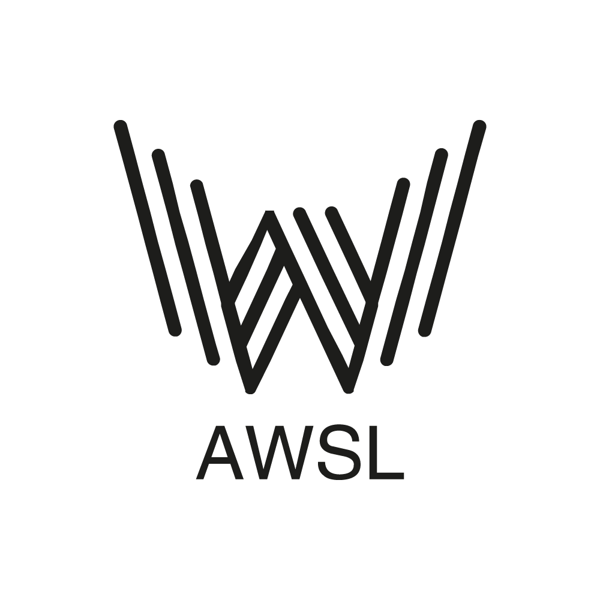
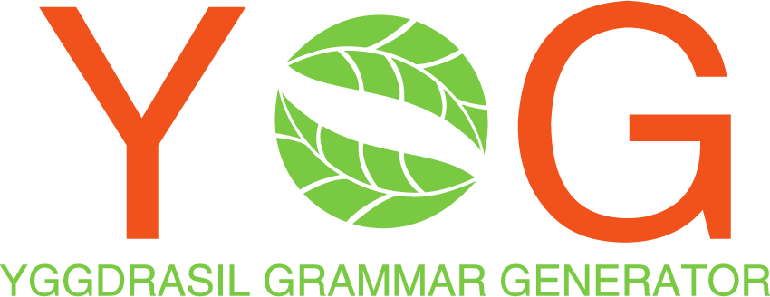
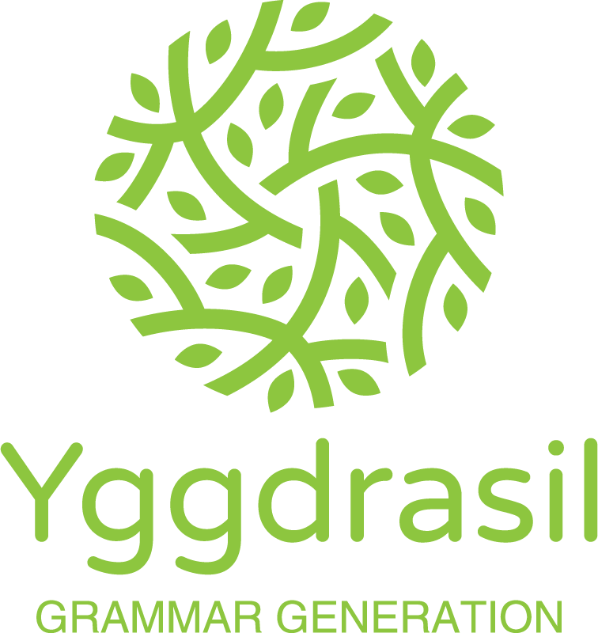
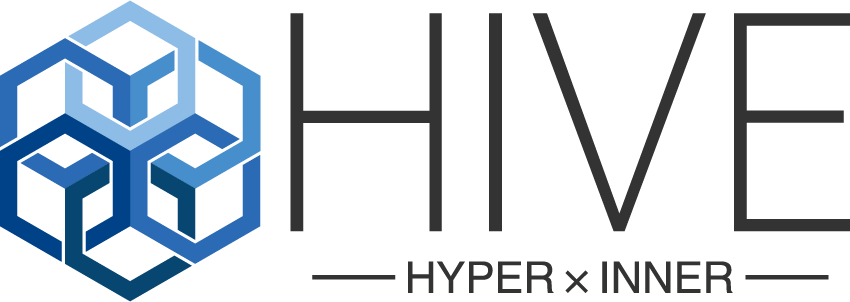
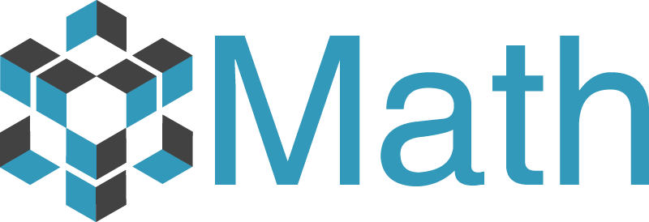
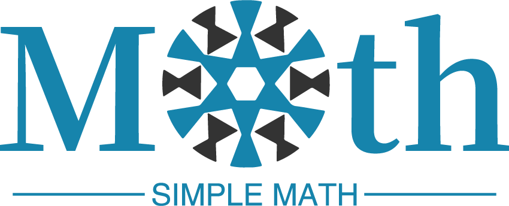
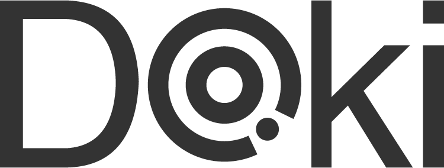
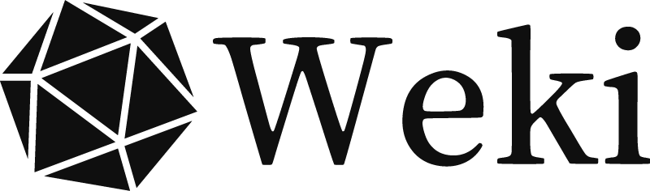
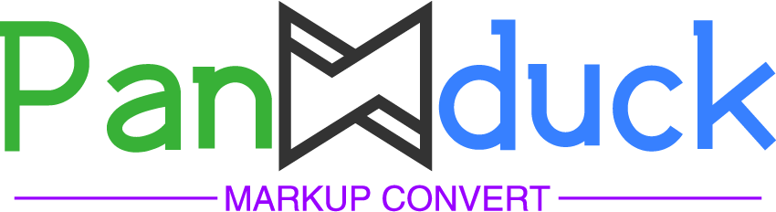

# Logo Design

## Logos

### JSS (Json Simplified Schema)

JSS 这个项目原来叫 PSV(Polyglot Schema Validator), 要做一个牛逼的 Validator Language.

然后难度太高就坑了, 直接抄袭 Json Schema, 于是就叫 JSC(Json Schema Copy) 了.

但是 jsc 让人联想到谏山创老贼, 想来想去, 那就叫 JSS(Json Simplified Schema) 吧

意象是一把锁, 旋转到正确的角度可以解锁数据.

很符合 Polyglot Schema Validator 的主旨.

### Awsl (Awesome Web, Simple Language)

意象很明显是个 W, 而且是 WWW, 这很万维网.

**啊我死了**

### YGG

YGG 是一种语法生成器, 从抽象语法树联想到树叶

### Hive

HIVE 是一种数据交换格式, 密集, 给人以高效的感觉

### SM

很像双曲空间

### Doki

Doki 是一个文档框架

LOGO 从 `O` 开始变形, 取了一个眼睛的形象

眼睛可以引申为扩展新视野, 很符合文档的定位

### Weki

Weki 是一个类 Wiki 框架

球上的节点

知识连接你我

(主要是二十面体骰子这个形状网上一搜就有, 很好抄)

### Panduck

Panduck 是一个标记文本转换器

棱角加对称的设计, 可以给人一种转变的感觉

中间是纯色, 本来想做渐变, 做了半天发现太蠢了, 看了

## License

License to [CC0 Universal]()