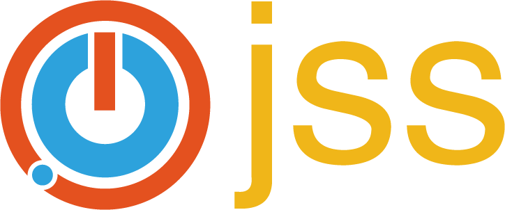

# Logo Design

## Logos

### JSS (Json Scheme Simplify)

一把锁

### Awsl (Awesome web, simple language)

### YGG

抽象语法树, 树叶

### Hive

### SM

### Doki

文档, 眼睛, 新视野

### Weki

### Panduck

Panduck 是一个标记文本转换器

扭角, 有一种转变的感觉

## License

License to CC0 Universal